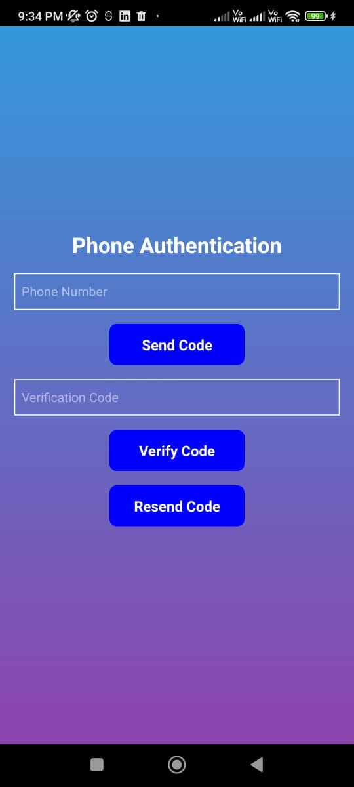
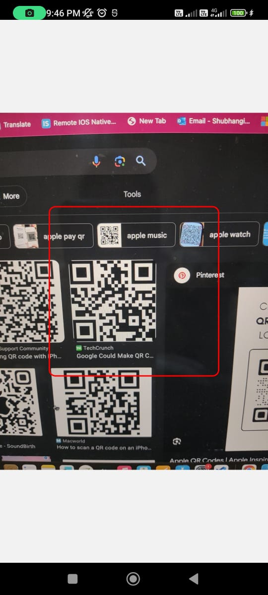
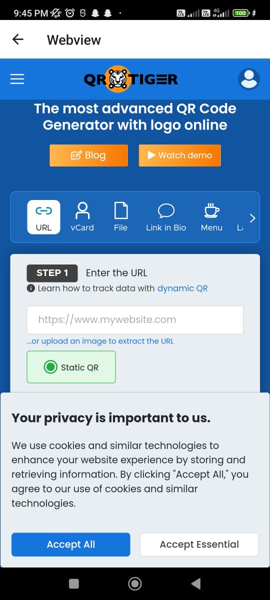

# QR Code Scanner App

## Overview

This React Native app allows users to perform OTP login using Firebase and scan QR codes containing website links. The scanned links are then opened within the app using a WebView.

## Screenshots


*Caption: OTP login using Firebase.*


*Caption: Scanning a QR code to extract the website link.*


*Caption: Displaying the website link within the app using WebView.*

## Features

- Firebase OTP login for secure authentication.
- QR code scanning functionality to extract website links.
- Seamless integration with WebView for in-app website display.

## Installation

1. Clone the repository.
   ```bash
   git clone https://github.com/your-username/qr-code-scanner.git
   ```

2. Install dependencies.
   ```bash
   cd qr-code-scanner
   npm install
   ```

3. Run the app.
   ```bash
   npm start
   ```

## Usage

1. Launch the app on your device or emulator.
2. Perform OTP login using your Firebase credentials.
3. Navigate to the QR code scanner screen.
4. Scan a QR code containing a website link.
5. The app will extract the link and display it using the integrated WebView.

## Technologies Used

- React Native
- Firebase Authentication
- WebView

